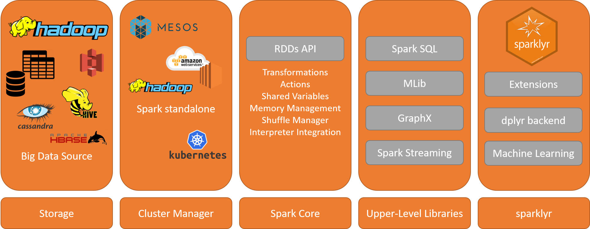

```{r setup, include=FALSE}
knitr::opts_chunk$set(echo = FALSE, warning=FALSE, error=FALSE, message = FALSE, background = "#3399FF")
```

#Introduction to Spark

##What is Apache Spark

Lightning-fast unified analytics engine. Combine SQL, streaming, and complex analytics.

```{r, out.width='80%', fig.align='center', fig.cap=''}

```

##What is Apache Spark

Apache Spark Core - provides a simple programming interface for processing large-scale datasets, the Resilent Distributed Datasets (RDD) API. 

It also including components for 

* task scheduling
* memory management
* data shuffling
* fault recovery
* interacting with storage systems
 
## Spark SQL

A **Dataset** is a distributed collection of data.

A **DataFrame** is a Dataset organized into named columns. It is conceptually equivalent to a table in a relational database or a data frame in R

## Higher Level Architecture

```{r, out.width='100%', fig.align='center', fig.cap=''}

```


#Introduction to dplyr

#Introduction to sparklyr

#References

##Further information is given at:

* [RStudio sparklyr homepage](http://spark.rstudio.com/)
* [RStudio sparklyr webinar series](https://www.rstudio.com/resources/webinars/#sparklyr)
* [Big data analytics on Apache Spark](https://link.springer.com/article/10.1007/s41060-016-0027-9) in the [International Journal of Data Science and Analytics](https://link.springer.com/journal/41060)
* [Learning Spark - Lightning-Fast Big Data Analysis](http://shop.oreilly.com/product/0636920028512.do): Written by the developers of Spark!
* [Sparklyr Cheat Sheet](https://www.rstudio.com/resources/cheatsheets/#sparklyr)
* [R for Data Science](http://r4ds.had.co.nz/): free online book by Garret Grolemund and Hadley Wickham